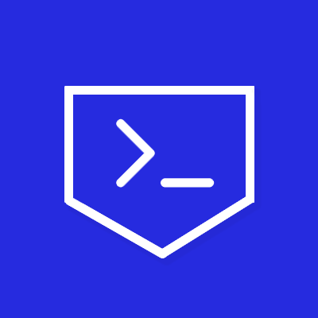

<div align="center">
  
  
  # SecureShell

  [](https://www.npmjs.com/package/secureshell-ts)
  [](https://pypi.org/project/secureshell/)
  [](https://opensource.org/licenses/MIT)
  [](https://www.typescriptlang.org/)
  [](https://www.python.org/)

  **A plug-and-play security layer for LLMs and Agents that prevents dangerous command execution.**
</div>

SecureShell acts as "sudo for LLMs" - a drop-in zero-trust gatekeeper that evaluates every shell command before execution. It blocks hallucinated commands, prevents platform mismatches (e.g., Unix commands on Windows), and helps agents learn from mistakes.

## Why SecureShell?

LLM agents with shell access can hallucinate dangerous commands like `rm -rf /` or `dd if=/dev/zero`. SecureShell solves this by:

- **Zero-Trust Gatekeeper** - Every command treated as untrusted until validated by independent gatekeeper
- **Platform-Aware** - Automatically blocks Unix commands on Windows (and vice versa)
- **Risk Classification** - GREEN/YELLOW/RED tiers with automatic handling
- **Agent Learning** - Clear feedback helps agents self-correct
- **Drop-in Integration** - Plug into LangChain, LangGraph, MCP, or use standalone
- **Multi-LLM Support** - Works with any LLM provider

## Quick Start

### TypeScript

```bash
npm install secureshell-ts
```

```typescript
import { SecureShell, OpenAIProvider } from 'secureshell-ts';

const shell = new SecureShell({
    provider: new OpenAIProvider({
        apiKey: process.env.OPENAI_API_KEY,
        model: 'gpt-4.1-mini'
    }),
    template: 'development'
});

const result = await shell.execute(
    'ls -la',
    'List files to check project structure'
);

if (result.success) {
    console.log(result.stdout);
} else {
    console.error('Blocked:', result.gatekeeper_reasoning);
}

await shell.close();
```

### Python

```bash
pip install secureshell
```

```python
import os
from secureshell import SecureShell
from secureshell.providers.openai import OpenAI

shell = SecureShell(
    template='development',
    provider=OpenAI(api_key=os.getenv("OPENAI_API_KEY"))
)

result = await shell.execute(
    command='ls -la',
    reasoning='List files to check project structure'
)

if result.success:
    print(result.stdout)
else:
    print(f"Blocked: {result.gatekeeper_reasoning}")

await shell.shutdown()
```

## How It Works

When an agent tries to run a command:

1. **Risk Classification** - Categorizes command as GREEN (safe), YELLOW (needs review), or RED (dangerous)
2. **Sandbox Check** - Validates paths against allowed/blocked lists
3. **Platform Check** - Ensures command compatibility with OS
4. **Zero-Trust Gatekeeper** - LLM evaluates YELLOW/RED commands with full context
5. **Execution or Denial** - Runs approved commands, blocks dangerous ones
6. **Agent Feedback** - Returns detailed reasoning for learning

**Example Flow:**

```
Agent: "Run 'ls -la'"
SecureShell: [On Windows] DENY - "ls is Unix-only, use 'dir' instead"

Agent: "Run 'dir'"  
SecureShell: ALLOW
Output: [directory listing]
```

## Features

### Security Templates

Drop-in security profiles for common scenarios - no configuration needed:

- **Paranoid** - Maximum security, blocks almost everything
- **Production** - Balanced for production deployments
- **Development** - Permissive for local development
- **CI/CD** - Optimized for automated pipelines

```typescript
const shell = new SecureShell({ template: 'paranoid' });
```

### Platform Awareness

Automatically detects OS and blocks incompatible commands:

```typescript
// On Windows
await shell.execute('rm -rf file.txt', 'Delete file');
// Blocked: "rm is Unix-only, use 'del' on Windows"

// On Linux
await shell.execute('del file.txt', 'Delete file');
// Blocked: "del is Windows-only, use 'rm' on Unix"
```

### LLM Providers

Plug in your preferred LLM for the zero-trust gatekeeper:

- **OpenAI** - GPT-4o, GPT-4.1-mini, GPT-3.5-turbo
- **Anthropic** - Claude 3.5 Sonnet, Claude 3.5 Haiku
- **Google Gemini** - Gemini 2.5 Flash, Gemini 1.5 Pro
- **DeepSeek** - deepseek-chat
- **Groq** - Llama 3.3, Mixtral
- **Ollama** - Local models (llama3, mistral, qwen)
- **LlamaCpp** - Local models via llama.cpp server

All providers support the same drop-in interface - just swap the provider.

### Framework Integrations

Drop into your existing LLM framework without changing your code:

**LangChain:**
```typescript
import { createSecureShellTool } from 'secureshell-ts';

const tool = createSecureShellTool(shell);
const agent = await createToolCallingAgent({ llm, tools: [tool], prompt });
```

**LangGraph:**
```typescript
const tool = createSecureShellTool(shell);
const workflow = new StateGraph({...}).addNode('tools', toolNode);
```

**MCP (Model Context Protocol):**
```typescript
import { createSecureShellMCPTool } from 'secureshell-ts';

const mcpTool = createSecureShellMCPTool(shell);
// Plug into Claude Desktop and other MCP clients
```

## Real-World Use Cases

- **AI DevOps Agents** - Safely automate deployments and infrastructure tasks
- **Code Assistants** - Allow file operations and git commands with guardrails
- **Data Processing** - Execute data pipelines with oversight
- **CI/CD Automation** - Run build and test commands securely
- **Local AI Assistants** - Give Claude Desktop safe shell access

## Documentation

- [Getting Started](docs/getting-started.md) - Installation and first steps
- [Security Templates](docs/features/security-templates.md) - Pre-built security profiles
- [Zero-Trust Gatekeeper](docs/features/gatekeeper.md) - How command evaluation works
- [Risk Classification](docs/features/risk-classification.md) - Understanding risk tiers
- [Platform Awareness](docs/features/platform-awareness.md) - OS-specific handling
- [Providers](docs/providers/openai.md) - LLM provider guides
- [Integrations](docs/integrations/langchain.md) - Framework integration guides
- [MCP Integration](docs/mcp.md) - Model Context Protocol setup

## Examples

Complete working examples for both TypeScript and Python:

- **Providers**: OpenAI, Anthropic, Gemini, DeepSeek, Groq, Ollama, LlamaCpp
- **Integrations**: LangChain, LangGraph, MCP
- **Use Cases**: DevOps automation, code assistants, data processing

Browse the [cookbook](examples/) for runnable code.

## Contributing

We welcome contributions! See [CONTRIBUTING.md](CONTRIBUTING.md) for guidelines.

## License

MIT License - see [LICENSE](LICENSE) for details.

## Support

- **Issues**: [GitHub Issues](https://github.com/divagr18/secureshell/issues)
- **Discussions**: [GitHub Discussions](https://github.com/divagr18/secureshell/discussions)

---

**Built for safety. Designed for autonomy.**
